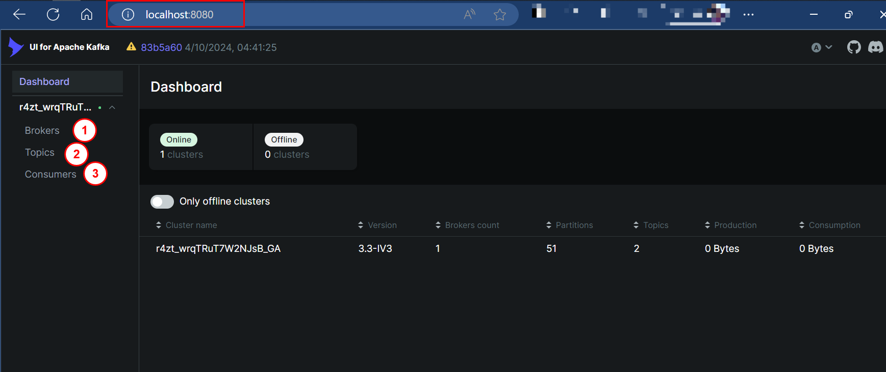

## Prerequisites

- [Docker](https://docs.docker.com/get-docker/)
- [Docker Compose](https://docs.docker.com/compose/install/)
- [Make](https://www.gnu.org/software/make/)

## Services

- **Kafka**: The distributed event streaming platform.
- **Python Kafka Client**: Sends a test message to a Kafka topic.

## Usage

### Build and Start the Services

To build and start the services, run:

```sh
make all
```

To start the services, run:

```sh
make up
```

To stop the services, run:

```sh
make down
```

To delete the services, run:

```sh
make clean
```

After starting the services, you can browse the UI services to know about the Messages, Topics, Brokers and Consumers registered.


